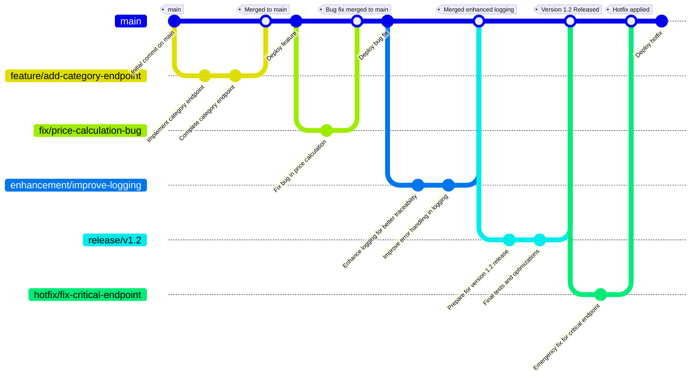

# Catalog Service Branching Strategy

This document outlines the **Trunk-Based Development (TBD) branching strategy** for the **Catalog Service**, with branch naming conventions and usage guidelines to ensure a streamlined and collaborative development process.

## Trunk-Based Development Strategy Overview

In Trunk-Based Development, the **main branch (trunk)** is the single source of truth, and developers create short-lived feature branches that are merged frequently. This approach promotes rapid integration and reduces merge conflicts.

## Key Branches and Naming Conventions

### 1. Main Branch (`main`)

- **Purpose**: The primary production-ready branch where stable code resides. All features and fixes are ultimately merged here.
- **Branch Name**: `main`
- **Direct Commits**: Avoid direct commits. Only small fixes or emergency changes may be made directly if urgently needed.

### 2. Short-Lived Feature Branches

- **Purpose**: Used for individual features, enhancements, or bug fixes. These branches are created from `main` and are merged back into `main` once the feature is complete and tested.
- **Naming Convention**: Use prefixes to clarify the purpose of each branch:
    - **Feature**: `feature/<short-description>`
        - Example: `feature/add-category-endpoint`
    - **Bug Fix**: `fix/<short-description>`
        - Example: `fix/price-calculation-bug`
    - **Enhancement**: `enhancement/<short-description>`
        - Example: `enhancement/improve-logging`
- **Duration**: Keep branches short-lived (1-3 days). Focus on completing small, atomic changes that can be merged quickly to avoid large, conflicting code changes.

### 3. Release Branch (Optional)

- **Purpose**: Occasionally, a release branch can be created for preparing and testing significant releases or versions without affecting `main`.
- **Branch Name**: `release/vX.Y`
    - Example: `release/v1.2`
- **Usage**: Useful for final bug fixes or optimizations before deployment. After testing and deployment, merge the release branch back into `main`.

### 4. Hotfix Branches (as needed)

- **Purpose**: For urgent fixes in production that need to be addressed immediately.
- **Naming Convention**: `hotfix/<short-description>`
    - Example: `hotfix/fix-critical-endpoint`
- **Process**: Create from `main`, apply the fix, and merge back into `main` as soon as possible.

## Branch Workflow Summary

1. **Create a Short-Lived Branch**: Start by branching off `main` using a clear, descriptive name.
2. **Implement and Test**: Develop the feature or fix, ensuring it’s small and focused. Run unit tests and perform code reviews.
3. **Merge Frequently**: Use pull requests (PRs) to merge back into `main` once the branch passes tests and review. Aim to merge daily or within 1-3 days.
4. **Deploy from `main`**: The `main` branch is always deployable, and automated CI/CD pipelines can be triggered upon merging.

## Example Branches

| Branch Name                     | Purpose                                  |
|---------------------------------|------------------------------------------|
| `main`                          | Primary production-ready branch          |
| `feature/add-category-endpoint` | New API endpoint for adding categories   |
| `fix/price-calculation-bug`     | Fix for an issue with price calculation  |
| `enhancement/improve-logging`   | Enhanced logging for error tracking      |
| `release/v1.2`                  | Prepare for version 1.2 release          |
| `hotfix/fix-critical-endpoint`  | Emergency fix for a critical endpoint    |

### Branching Strategy in the Diagram

### Explanation of the Branching Strategy in the Diagram

- **Main Branch (`main`)**: All completed work and deployments are merged into `main`.
- **Feature Branch (`feature/add-category-endpoint`)**: A short-lived branch for a specific feature. Merged back into `main` once completed.
- **Fix Branch (`fix/price-calculation-bug`)**: A short-lived branch for a bug fix. Merged back into `main` after testing.
- **Enhancement Branch (`enhancement/improve-logging`)**: A branch for improvements. Merged back into `main` after implementation.
- **Release Branch (`release/v1.2`)**: A temporary branch for preparing a specific version, merged back into `main` once stable.
- **Hotfix Branch (`hotfix/fix-critical-endpoint`)**: A high-priority fix, created directly from `main` and merged back after resolution.

This branching strategy follows a trunk-based development approach, where `main` remains the primary branch for all stable code, and short-lived branches are used for features, fixes, enhancements, releases, and hotfixes.

## Benefits of This Strategy for Catalog Service

- **Fast Feedback**: Frequent integration ensures that issues are identified quickly.
- **Reduced Merge Conflicts**: Short-lived branches reduce the chances of large, conflicting merges.
- **Simplified Release Process**: The `main` branch is always in a deployable state, allowing smooth CI/CD deployment.

Using this trunk-based strategy helps the **Catalog Service** team maintain rapid development cycles with stable, production-ready code at all times.
