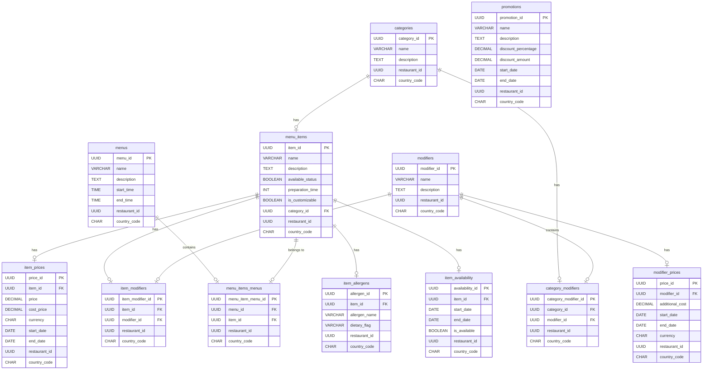

# Catalog Service - Database Definition Language (DDL)

This document provides the **DDL (Data Definition Language)** for the **Catalog Service**. The database schema is designed to support the management of categories, menu items, prices, modifiers, promotions, allergens, and availability for multiple restaurants across various countries.

## Schema Overview

### Enable UUID Extension (for PostgreSQL)
Enable the `uuid-ossp` extension in PostgreSQL to use `UUID` as primary keys:

```postgres-sql
CREATE EXTENSION IF NOT EXISTS "uuid-ossp";
```

### Categories Table
Defines different categories for menu items.

```postgres-sql
CREATE TABLE categories (
    category_id UUID PRIMARY KEY DEFAULT uuid_generate_v4(),
    name VARCHAR(30) UNIQUE NOT NULL,
    description TEXT,
    restaurant_id UUID NOT NULL,
    country_code CHAR(2) NOT NULL
);
```
### Menu Items Table
Contains details of individual menu items.
```postgres-sql
CREATE TABLE menu_items (
    item_id UUID PRIMARY KEY DEFAULT uuid_generate_v4(),
    name VARCHAR(50) NOT NULL,
    description TEXT,
    available_status BOOLEAN DEFAULT TRUE,
    preparation_time INT,
    is_customizable BOOLEAN DEFAULT FALSE,
    category_id UUID REFERENCES categories(category_id) ON DELETE SET NULL,
    restaurant_id UUID NOT NULL,
    country_code CHAR(2) NOT NULL
);
```

### Item Prices Table
Stores pricing details for each menu item.

```postgres-sql
CREATE TABLE item_prices (
    price_id UUID PRIMARY KEY DEFAULT uuid_generate_v4(),
    item_id UUID REFERENCES menu_items(item_id) ON DELETE CASCADE,
    price DECIMAL(15, 2) NOT NULL,
    cost_price DECIMAL(15, 2),
    currency CHAR(3) DEFAULT 'USD',
    start_date DATE NOT NULL,
    end_date DATE,
    restaurant_id UUID NOT NULL,
    country_code CHAR(2) NOT NULL,
    UNIQUE (item_id, start_date, restaurant_id, country_code)
);
```

### Modifiers Table
Holds customizable options for items, like toppings.
```postgres-sql
CREATE TABLE modifiers (
    modifier_id UUID PRIMARY KEY DEFAULT uuid_generate_v4(),
    name VARCHAR(50) NOT NULL,
    description TEXT,
    restaurant_id UUID NOT NULL,
    country_code CHAR(2) NOT NULL
);
```
### Modifier Prices Table
Stores additional costs associated with each modifier.
```postgres-sql
CREATE TABLE modifier_prices (
    price_id UUID PRIMARY KEY DEFAULT uuid_generate_v4(),
    modifier_id UUID REFERENCES modifiers(modifier_id) ON DELETE CASCADE,
    additional_cost DECIMAL(15, 2) DEFAULT 0,
    start_date DATE NOT NULL,
    end_date DATE,
    currency CHAR(3) DEFAULT 'USD',
    restaurant_id UUID NOT NULL,
    country_code CHAR(2) NOT NULL,
    UNIQUE (modifier_id, start_date, restaurant_id, country_code)
);
```

### Item Modifiers Table (Many-to-Many Relationship)
Associates menu items with modifiers.
```postgres-sql
CREATE TABLE item_modifiers (
    item_modifier_id UUID PRIMARY KEY DEFAULT uuid_generate_v4(),
    item_id UUID REFERENCES menu_items(item_id) ON DELETE CASCADE,
    modifier_id UUID REFERENCES modifiers(modifier_id) ON DELETE CASCADE,
    restaurant_id UUID NOT NULL,
    country_code CHAR(2) NOT NULL,
    UNIQUE (item_id, modifier_id, restaurant_id, country_code)
);
```

### Promotions Table
Manages discounts and promotional offers.
```postgres-sql
CREATE TABLE promotions (
    promotion_id UUID PRIMARY KEY DEFAULT uuid_generate_v4(),
    name VARCHAR(50) NOT NULL,
    description TEXT,
    discount_percentage DECIMAL(5, 2),
    discount_amount DECIMAL(15, 2),
    start_date DATE NOT NULL,
    end_date DATE,
    restaurant_id UUID,
    country_code CHAR(2)
);
```

### Menus Table
Defines different menus for times or events.
```postgres-sql
CREATE TABLE menus (
    menu_id UUID PRIMARY KEY DEFAULT uuid_generate_v4(),
    name VARCHAR(50) NOT NULL,
    description TEXT,
    start_time TIME,
    end_time TIME,
    restaurant_id UUID NOT NULL,
    country_code CHAR(2) NOT NULL
);
```

### Menu Item-Menu Association Table
Associates items with specific menus.
```postgres-sql
CREATE TABLE menu_items_menus (
    menu_item_menu_id UUID PRIMARY KEY DEFAULT uuid_generate_v4(),
    menu_id UUID REFERENCES menus(menu_id) ON DELETE CASCADE,
    item_id UUID REFERENCES menu_items(item_id) ON DELETE CASCADE,
    restaurant_id UUID NOT NULL,
    country_code CHAR(2) NOT NULL,
    UNIQUE (menu_id, item_id, restaurant_id, country_code)
);
```

### Category-Modifier Association Table
Applies modifiers to entire categories.
```postgres-sql
CREATE TABLE category_modifiers (
    category_modifier_id UUID PRIMARY KEY DEFAULT uuid_generate_v4(),
    category_id UUID REFERENCES categories(category_id) ON DELETE CASCADE,
    modifier_id UUID REFERENCES modifiers(modifier_id) ON DELETE CASCADE,
    restaurant_id UUID NOT NULL,
    country_code CHAR(2) NOT NULL,
    UNIQUE (category_id, modifier_id, restaurant_id, country_code)
);
```

### Allergen and Dietary Information Table
Tracks allergens or dietary flags for each item.
```postgres-sql
CREATE TABLE item_allergens (
    allergen_id UUID PRIMARY KEY DEFAULT uuid_generate_v4(),
    item_id UUID REFERENCES menu_items(item_id) ON DELETE CASCADE,
    allergen_name VARCHAR(50) NOT NULL,
    dietary_flag VARCHAR(50),
    restaurant_id UUID NOT NULL,
    country_code CHAR(2) NOT NULL
);
```

#### Item Availability Table
Manages specific availability periods for items.
```postgres-sql
CREATE TABLE item_availability (
    availability_id UUID PRIMARY KEY DEFAULT uuid_generate_v4(),
    item_id UUID REFERENCES menu_items(item_id) ON DELETE CASCADE,
    start_date DATE,
    end_date DATE,
    is_available BOOLEAN DEFAULT TRUE,
    restaurant_id UUID NOT NULL,
    country_code CHAR(2) NOT NULL
);
```

## Summary of Tables

- **Categories**: Defines item categories for various restaurants and countries.
- **Menu Items**: Stores details for each menu item, including customization and availability.
- **Item Prices**: Manages prices for items with support for time, currency, and region-specific pricing.
- **Modifiers**: Holds item modifiers like extra toppings or sizes.
- **Modifier Prices**: Manages additional costs for modifiers, with time- and location-based pricing.
- **Item Modifiers**: Links modifiers to items in a many-to-many relationship.
- **Promotions**: Manages discounts or promotions for items, categories, or restaurants.
- **Menus**: Defines specific menus for times or locations (e.g., breakfast, lunch).
- **Menu Item-Menu Association**: Associates items with specific menus.
- **Category Modifiers**: Applies modifiers to all items in a category.
- **Allergens and Dietary Flags**: Tracks allergen and dietary information for each item.
- **Item Availability**: Manages seasonal or time-based availability for items.

### Summary of Execution Order

1. **Enable UUID extension**:
    - Enable the UUID extension to use `UUID` as primary keys.

2. **Create independent tables**:
    - `categories`
    - `modifiers`
    - `promotions`
    - `menus`

3. **Create tables with dependencies**:
    - `menu_items`
    - `item_prices`
    - `modifier_prices`

4. **Create many-to-many relationship tables**:
    - `item_modifiers`
    - `menu_items_menus`
    - `category_modifiers`

5. **Create additional supporting tables**:
    - `item_allergens`
    - `item_availability`

Following this order will ensure that each table is created with its required dependencies in place, avoiding errors related to missing references. This structure supports multi-restaurant, multi-country functionality with clear relationships and constraints.

